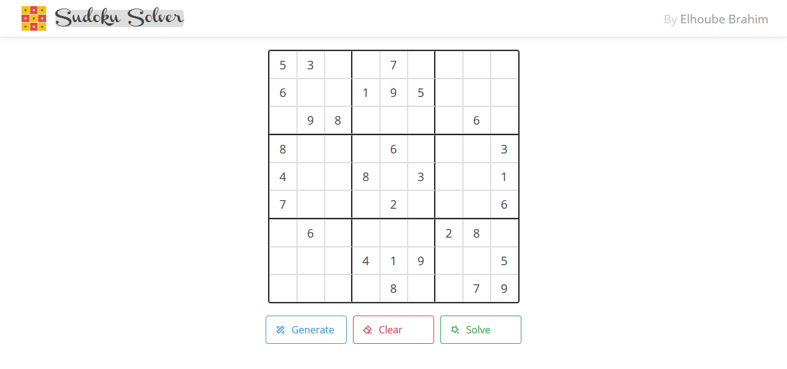

[](https://github.com/ElhoubeBrahim/sudoku_solver/network)
[](https://github.com/ElhoubeBrahim/sudoku_solver/stargazers)
[](https://github.com/ElhoubeBrahim/sudoku_solver/issues)
[](https://github.com/ElhoubeBrahim/sudoku_solver)

<p align="center">
  <h1 align="center">Sudoku Solver Website</h1>
  
   

  <p align="center">
    Website for generating and solving sudoku puzzles, using different algorithms!
    <br />
    <br />
    <a href="https://elhoubebrahim.github.io/sudoku_solver/">View Demo</a>
    ·
    <a href="https://github.com/ElhoubeBrahim/sudoku_solver/issues">Report Bug</a>
    ·
    <a href="https://github.com/ElhoubeBrahim/sudoku_solver/issues">Request Feature</a>
  </p>
</p>

<!-- TABLE OF CONTENTS -->

## Table of Contents

- [About the Project](#about-the-project)
  - [Built With](#built-with)
- [Getting Started](#getting-started)
- [Contributing](#contributing)
- [Contact](#contact)

<!-- ABOUT THE PROJECT -->

## About The Project

I start learning about sudoku solving algorithms for a while, then I decided to apply what I learned in this project. I had a great experience building it, and I got a lot of new knowledges.

### Built With

- HTML
- SCSS
- JavaScript
- JS OOP

<!-- GETTING STARTED -->

## Getting Started

To get started with this project, you don't need much, just a browser installed, and follow next instructions

1. Clone the repo or download it

```sh
git clone https://github.com/ElhoubeBrahim/sudoku_solver.git
```

2. Extract project files

3. Open the `index.html` file with your default browser

4. Enjoy it \*\_\*

<!-- CONTRIBUTING -->

## Contributing

Contributions are what make the open source community such an amazing place to be learn, inspire, and create. Any contributions you make are **greatly appreciated**.

1. Fork the Project
2. Create your Feature Branch (`git checkout -b feature/AmazingFeature`)
3. Commit your Changes (`git commit -m 'Add some AmazingFeature'`)
4. Push to the Branch (`git push origin feature/AmazingFeature`)
5. Open a Pull Request

<!-- CONTACT -->

## Contact

Brahim Elhoube - [facebook](https://www.facebook.com/brahim.elhoube) - brahim.elhoube@elwork.me

Project Link: [https://github.com/ElhoubeBrahim/sudoku_solver](https://github.com/ElhoubeBrahim/sudoku_solver)
